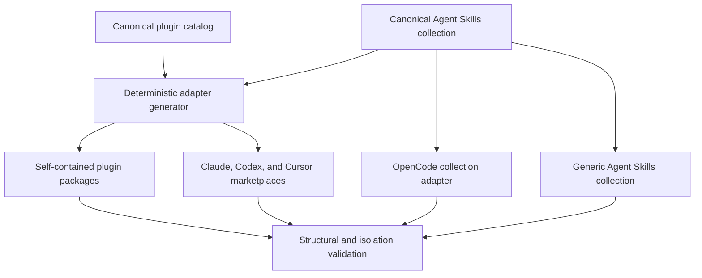
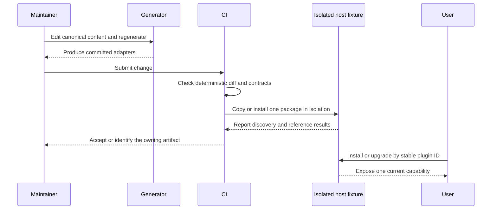

# Multi-Tool Plugin Distribution - Plan

## Goal Capsule

- **Objective:** Reorganize the repository around one canonical definition for each Django capability and provide maintained distribution adapters for Claude Code, Codex, Cursor, OpenCode, generic Agent Skills clients, and the Codex-compatible `.agents/plugins` marketplace.
- **Authority:** The Product Contract and session-settled KTDs govern behavior and scope. Current tool documentation governs host contracts. Local compatibility tests govern details that tool documentation leaves uncertain.
- **Execution profile:** Deep packaging and repository-architecture change. Prove structural portability and isolated install behavior before changing all packages.
- **Stop conditions:** Stop and surface a blocker if an existing public plugin ID or package root cannot remain installable, or if current Cursor verification contradicts the proposed native adapter without a compatible fallback.
- **Tail ownership:** Finish with validated local artifacts, migration documentation, and CI. Do not publish to external registries or official marketplaces.

---

## Product Contract

### Summary

The repository will keep its five independently installable plugin identities while moving skill content into a consistent canonical collection. Deterministic tooling will derive self-contained plugin packages and host-native metadata so every supported tool receives the same capability content without independently maintained copies.

### Problem Frame

The repository already exposes Claude and Codex metadata, but its manually maintained inventories have drifted: the Codex marketplace lists five plugins while the Claude marketplace lists three. Skill layout is inconsistent, documentation is host-biased, and `django-reviewer` advertises Codex review capability without an executable Codex skill.

Adding more hand-maintained manifests would multiply that drift. Marketplace installs also copy plugin packages into host caches, so a layout that works only from the source checkout can fail after installation when references escape the package root.

### Actors

- A1. **Plugin user** installs, updates, invokes, or removes one or more Django capabilities through a supported AI tool.
- A2. **Repository maintainer** edits canonical content, adds capabilities, regenerates adapters, and reviews drift.
- A3. **CI validator** checks canonical content, generated output, cache isolation, and marketplace parity without touching a real user profile.

### Requirements

#### Canonical capabilities and packaging

- R1. Preserve the public IDs and package roots for `django-expert`, `django-celery-expert`, `cdrf-expert`, `django-safe-migration`, and `django-reviewer`.
- R2. Store each reusable capability once in a self-contained Agent Skills directory whose `name` matches its directory and whose local references remain inside that directory.
- R3. Maintain one canonical inventory for shared plugin identity, version, description, capability kind, source path, supported hosts, and deliberate per-host overrides.
- R4. Produce self-contained plugin packages whose cached installation does not depend on repository-root files, escaping relative paths, or external symlinks.

#### Host support and parity

- R5. Provide native or documented support for Claude Code, Codex, Cursor, OpenCode, generic Agent Skills clients, and `.agents/plugins`.
- R6. Use host-native manifests and discovery mechanisms instead of forcing one schema across all tools.
- R7. Expose each supported capability exactly once through the recommended installation channel for a host and document duplicate/shadow-copy remediation.
- R8. Preserve the `django-reviewer` review standards across hosts while retaining the Claude agent as a Claude-specific surface.
- R9. Keep authentication, consent, credential entry, and tool permission approval human-controlled.

#### Maintainer workflow and quality

- R10. Generate all duplicated marketplace and manifest metadata deterministically from the canonical inventory and keep generated output committed for direct Git and local installs.
- R11. Fail validation on stale or orphaned adapters, duplicate IDs, missing capabilities, invalid frontmatter, unresolved references, escaping paths, or advertised plugins with no usable surface.
- R12. Verify package behavior from isolated copies and temporary tool homes so source-checkout success cannot hide cache-install failures.
- R13. Document install, update, uninstall, compatibility, graceful-degradation, and maintainer add/remove flows for every supported host.

### Key Flows

- F1. **Maintain a capability**
  - **Trigger:** A2 changes canonical content or metadata.
  - **Actors:** A2, A3
  - **Steps:** Edit the canonical source, regenerate adapters, run check-only validation, and review the committed diff.
  - **Outcome:** Every declared host artifact matches the canonical inventory and no hand-authored content is overwritten.
  - **Covered by:** R2, R3, R10, R11

- F2. **Install or upgrade a plugin**
  - **Trigger:** A1 selects a plugin through the recommended host channel.
  - **Actors:** A1
  - **Steps:** Register the relevant marketplace or collection, install by the stable public ID, restart or reload when the host requires it, and verify one discovered capability.
  - **Outcome:** The installed cache contains a self-contained capability with the same public ID and current content.
  - **Covered by:** R1, R4, R5, R7, R12, R13

- F3. **Invoke Django review**
  - **Trigger:** A1 requests review of recent Django changes.
  - **Actors:** A1
  - **Steps:** A custom-agent host selects its agent surface; a skill-only host selects the portable fallback; the reviewer scopes to the diff or explicit target.
  - **Outcome:** The reviewer preserves behavior and edits only with user/host authorization; otherwise it reports findings.
  - **Covered by:** R8, R9

### Acceptance Examples

- AE1. **Existing ID survives migration**
  - **Covers:** R1, R4, R12
  - **Given:** An isolated fixture installs `django-expert` by its current plugin ID.
  - **When:** The fixture uses the reorganized marketplace and package.
  - **Then:** Exactly one `django-expert` skill is discoverable and all referenced files load from the cached package.

- AE2. **Marketplace drift is rejected**
  - **Covers:** R3, R10, R11
  - **Given:** A generated marketplace omits `django-safe-migration`.
  - **When:** Check-only validation runs.
  - **Then:** Validation fails with the missing plugin ID and generated file path.

- AE3. **OpenCode uses the canonical collection**
  - **Covers:** R2, R5, R7
  - **Given:** A clean OpenCode fixture registers the repository adapter.
  - **When:** OpenCode enumerates skills.
  - **Then:** The five capability IDs appear once without a separately maintained skill tree.

- AE4. **Reviewer degrades safely**
  - **Covers:** R8, R9
  - **Given:** A skill-only host denies edit permission.
  - **When:** `django-reviewer` reviews a Django diff.
  - **Then:** It returns bounded findings without escalating permission or modifying files.

- AE5. **New capability fans out deterministically**
  - **Covers:** R3, R5, R10, R11
  - **Given:** A complete sixth fixture capability and inventory record.
  - **When:** Adapter generation runs.
  - **Then:** Every declared marketplace and host manifest gains the capability and a second run produces no diff.

- AE6. **Cursor uncertainty is contained**
  - **Covers:** R5, R6, R12
  - **Given:** A temporary Cursor project and the current supported local install path.
  - **When:** The compatibility gate verifies discovery and reference loading.
  - **Then:** The selected native or generated adapter registers each capability once without relying on an unverified symlink behavior.

### Success Criteria

- All supported marketplace inventories are generated from one catalog and contain the intended five public IDs.
- Every canonical skill passes Agent Skills validation and package-isolation checks.
- Claude, Codex, Cursor, and OpenCode smoke fixtures discover the intended capability surfaces once.
- `django-reviewer` has a usable portable skill fallback and retains its Claude agent behavior.
- Maintainers can regenerate and validate all committed adapters with documented commands.

### Scope Boundaries

#### In scope

- Repository layout, canonical capability content, generated package copies, manifests, marketplaces, host adapters, validation, CI, and installation documentation.
- Compatibility migration from the current flat and nested skill layouts.
- Tool-specific graceful degradation and isolated smoke-test fixtures.

#### Deferred to Follow-Up Work

- Publication to official, public, or third-party marketplaces and registries.
- Automated release creation, changelog generation, telemetry, and usage analytics.
- Support for tools beyond Claude Code, Codex, Cursor, OpenCode, and generic Agent Skills clients.
- A durable `docs/solutions/` learning after the implementation has produced verified conventions.

#### Outside this plan

- Changing the Django subject-matter guidance except where host-neutral wording or portable reviewer behavior requires it.
- Bypassing host authentication, consent, credential, or permission prompts.
- Renaming existing plugin IDs, package roots, or marketplace identities.

---

## Planning Contract

### Key Technical Decisions

- KTD1. **Use a root canonical skill collection and generated package-local projections.** Canonical content lives under `skills/<capability-id>/`; it is the only hand-authored behavior source. Generator-owned package projections are complete, replaceable outputs and never import or reference the root collection at runtime. This supports both a whole-repository collection and five independently cached plugins. Package-local canonical skills were rejected because they would require an additional aggregate authoring surface or a host-specific multi-root collection. (session-settled: user-approved — chosen over independently maintained tool trees: one source prevents content drift while generated projections satisfy cache isolation.) Governs R2, R4, R10.

- KTD2. **Keep the five plugin roots and public IDs stable.** Reorganize internal files and adapters without changing the installation boundary at `plugins/<id>/`. (session-settled: user-approved — chosen over a clean-slate root-native package: compatibility matters more than collapsing five public plugins into one.) Governs R1, R4.

- KTD3. **Generate host-native metadata from a single JSON catalog.** Use a dependency-free, machine-readable catalog at `plugins/catalog.json`; shared fields come from the catalog and target-specific overrides remain explicit. Committed generated output is the distribution artifact, while check-only regeneration is the drift gate. Governs R3, R6, R10, R11.

- KTD4. **Prefer native host contracts with declared degradation.** Claude, Codex, and Cursor marketplace installs consume only generated package-local content. OpenCode’s repository package and generic Agent Skills installs consume only the root canonical collection. Direct skill installation on a native-plugin host is a mutually exclusive alternative, not an additive setup. (session-settled: user-approved — chosen over forced identical manifests and capabilities: the hosts expose different plugin and agent primitives.) Governs R5-R7.

- KTD5. **Model `django-reviewer` as one portable review contract plus non-colliding host projections.** The canonical skill owns review scope and standards. The Claude package exposes only its custom agent, while Codex and other skill-based package hosts receive a generated projection under a non-Claude-discovered package path such as `portable-skills/django-reviewer/`. Host manifests map that projection explicitly, and edits occur only when authorization is explicit. Governs R7-R9.

- KTD6. **Use Compound Engineering as structural prior art, not a code template.** Borrow its self-contained skills, thin marketplaces, cache-aware paths, native OpenCode registration, and validation posture without importing its workflow engine, converters, or release machinery. (session-settled: user-approved — chosen over copying the upstream repository wholesale: this project has five small Django packages and a narrower runtime surface.) Governs R2-R7, R10-R12.

- KTD7. **Keep publication outside the implementation tail.** Build and validate local/distributable artifacts, but do not publish or authenticate to external marketplaces. (session-settled: user-approved — chosen over releasing during the reorganization: publication adds irreversible coordination beyond the requested repository work.) Governs R9, R13.

- KTD8. **Gate Cursor’s final adapter on a current isolated smoke test.** Start from the current `.cursor-plugin` prior art, but permit only package-internal representations after the installed fixture proves discovery, resource loading, and one-registration behavior. No installed Cursor package may link or resolve back to root `skills/`. Governs R4-R6, R12.

- KTD9. **Recommend one installation channel per host.** Codex uses `.agents/plugins`, Claude uses its marketplace, Cursor uses its plugin adapter, and OpenCode uses its package adapter; generic direct skill installation is documented as an alternative, not stacked with native plugin installation. Governs R7, R13.

### Host Content Tiers

| Host/channel | Authoritative content tier | Duplicate boundary |
|---|---|---|
| Claude marketplace | Generated package-local agent or skill projection | Do not also install root skills directly. |
| Codex `.agents/plugins` | Generated package-local skill projection | Do not also register the same ID as a direct skill. |
| Cursor marketplace | Verified generated package-internal projection | Do not rely on root links or a second direct skill install. |
| OpenCode repository package | Root canonical `skills/` collection | Do not also copy the same IDs into project discovery paths. |
| Generic Agent Skills client | Root canonical `skills/<id>/` directory | Native plugin installation is an alternative channel. |

### High-Level Technical Design

#### Canonical-to-distribution topology



The catalog owns shared metadata; canonical skill directories own behavior. Generated package copies and manifests are replaceable outputs, not secondary authoring surfaces.

#### Change and installation lifecycle



### Output Structure

```text
.
├── .agents/
│   └── plugins/
│       └── marketplace.json
├── .claude-plugin/
│   └── marketplace.json
├── .cursor-plugin/
│   └── marketplace.json
├── .github/
│   └── workflows/
│       └── validate-plugins.yml
├── .opencode/
│   ├── INSTALL.md
│   └── plugins/
│       └── django-ai-skills.js
├── package.json
├── docs/
│   ├── compatibility.md
│   ├── installation.md
│   └── plans/
├── plugins/
│   ├── catalog.json
│   ├── <ordinary-skill-plugin-id>/
│   │   ├── .claude-plugin/plugin.json
│   │   ├── .codex-plugin/plugin.json
│   │   ├── .cursor-plugin/plugin.json
│   │   ├── skills/<plugin-id>/
│   │   └── README.md
│   └── django-reviewer/
│       ├── .claude-plugin/plugin.json
│       ├── .codex-plugin/plugin.json
│       ├── .cursor-plugin/plugin.json
│       ├── agents/django-reviewer.md
│       ├── portable-skills/django-reviewer/
│       └── README.md
├── scripts/
│   ├── generate_adapters.py
│   ├── smoke_plugins.py
│   └── validate_plugins.py
├── skills/
│   └── <capability-id>/
│       ├── SKILL.md
│       └── references/
└── tests/
    ├── fixtures/
    │   ├── hosts/
    │   └── packages/legacy/
    ├── test_adapter_generation.py
    ├── test_install_lifecycle.py
    ├── test_plugin_catalog.py
    ├── test_reviewer_parity.py
    └── test_skill_contracts.py
```

### Sequencing

1. Establish the catalog and validation vocabulary without breaking current packages.
2. Pilot the canonical layout and generator on one ordinary skill, then migrate the remaining skill content.
3. Add the reviewer’s dual surface after the ordinary skill contract is stable.
4. Generate native host marketplaces and adapters, with Cursor behind its compatibility gate.
5. Add isolated lifecycle smoke tests, CI, and documentation after adapter paths are settled.

### Deferred Implementation Notes

- Confirm whether current Cursor requires physical skill copies, supports inward package references, or follows repository links before finalizing its generated shape.
- Verify that the generated Claude manifest exposes only the reviewer agent, while skill-only hosts explicitly map the non-discoverable `portable-skills/django-reviewer/` projection. Treat any dual Claude registration as a generation error.
- Test the existing generic `plugins` CLI against the normalized nested layout before deciding whether any temporary legacy-layout compatibility artifact is necessary. Do not keep both discoverable `SKILL.md` locations if they double-register.

---

## Implementation Units

### U1. Canonical plugin catalog and validation foundation

- **Goal:** Establish the authoritative inventory and the dependency-free validation contract before moving content.
- **Requirements:** R1, R3, R10, R11
- **Dependencies:** None
- **Files:**
  - Create `plugins/catalog.json`
  - Create `scripts/validate_plugins.py`
  - Create `tests/test_plugin_catalog.py`
  - Create `tests/fixtures/catalog/`
  - Create `tests/fixtures/catalog/marketplaces/`
- **Approach:** Capture all five IDs, versions, shared metadata, package roots, capability kinds, supported hosts, and explicit target overrides. Validation distinguishes hand-authored inputs from generator-owned outputs and rejects incomplete add/remove transactions.
- **Execution note:** Start with failing fixtures for the current Claude/Codex marketplace drift and an advertised plugin with no executable surface.
- **Patterns to follow:** Existing stable `plugins/<id>/` roots; Compound Engineering’s thin marketplace separation; Agent Skills naming rules.
- **Test scenarios:**
  1. Parse the current five-record catalog and confirm each ID maps to an existing package root.
  2. Reject duplicate IDs, unknown package roots, missing required metadata, invalid versions, and unsupported capability kinds with the owning ID and path.
  3. Detect a missing marketplace entry, an extra/orphan entry, and inconsistent shared metadata.
  4. Remove a fixture catalog record and confirm validation identifies only generator-owned orphan records, not hand-authored package files.
- **Verification:** The catalog represents all five public plugins, both existing marketplaces can be checked against it, and invalid fixtures fail with actionable paths.

### U2. Canonical Agent Skills collection and package materialization

- **Goal:** Normalize the four existing skills into one portable root collection and generate self-contained package-local copies.
- **Requirements:** R1-R4, R10-R12
- **Dependencies:** U1
- **Files:**
  - Create `skills/django-expert/SKILL.md` and move its `references/`
  - Create `skills/django-celery-expert/SKILL.md` and move its `references/`
  - Create `skills/cdrf-expert/SKILL.md` and move its `references/`
  - Create `skills/django-safe-migration/SKILL.md` and move its `references/`
  - Modify generated `plugins/django-expert/skills/django-expert/`
  - Modify generated `plugins/django-celery-expert/skills/django-celery-expert/`
  - Modify generated `plugins/cdrf-expert/skills/cdrf-expert/`
  - Modify generated `plugins/django-safe-migration/skills/django-safe-migration/`
  - Remove superseded `plugins/*/skills/SKILL.md`
  - Create `scripts/generate_adapters.py`
  - Create `tests/test_skill_contracts.py`
  - Create `tests/test_adapter_generation.py`
  - Create `tests/fixtures/skills/`
- **Approach:** The root `skills/<id>/` directories become hand-authored. Generation materializes complete, byte-derived skill units inside each independently installable plugin package. It uses staged replacement and supports write and check-only modes.
- **Execution note:** Pilot the move on `cdrf-expert`; prove isolated copy and reference resolution before migrating the other three skills.
- **Patterns to follow:** `plugins/django-safe-migration/skills/django-safe-migration/` for the target nested package shape; Agent Skills self-contained `SKILL.md` plus local resources.
- **Test scenarios:**
  1. Validate each canonical skill’s required frontmatter, directory/name equality, description bounds, and local references.
  2. Reject absolute paths, escaping `../` paths, cross-skill references, case-mismatched resources, and host-only canonical frontmatter.
  3. Generate package copies in a temporary directory and assert they contain the canonical resource set and no unresolved markers.
  4. Run generation twice and assert the second run produces no changes.
  5. Force a generation failure and assert no committed output is partially replaced.
  6. Copy each plugin package without the repository root and confirm its skill and references still resolve.
  7. Assert no package contains both `skills/SKILL.md` and `skills/<id>/SKILL.md`.
- **Verification:** The four canonical skills pass the official Agent Skills validator, package copies are deterministic and isolated, and existing public package roots remain intact.

### U4. Portable django-reviewer with Claude agent compatibility

- **Goal:** Make `django-reviewer` usable on skill-only hosts while preserving its Claude agent surface and safety boundary.
- **Requirements:** R4-R9, R11, R12
- **Dependencies:** U1, U2
- **Files:**
  - Create `skills/django-reviewer/SKILL.md`
  - Modify `plugins/django-reviewer/agents/django-reviewer.md`
  - Create generated `plugins/django-reviewer/portable-skills/django-reviewer/SKILL.md`
  - Create `tests/test_reviewer_parity.py`
  - Create `tests/fixtures/reviewer/`
- **Approach:** Extract platform-neutral review standards, recent-diff scoping, and behavior-preservation rules into the canonical skill. Keep Claude-only model/proactive metadata in the agent adapter. Materialize the portable projection under non-discoverable `portable-skills/`; U3 will map it explicitly for skill hosts while exposing only the agent to Claude. The portable skill applies changes only after explicit edit intent or host authorization and otherwise reports findings.
- **Execution note:** Add characterization coverage for current reviewer guidance before extracting the shared contract.
- **Patterns to follow:** Existing `plugins/django-reviewer/agents/django-reviewer.md`; canonical project-instruction wording rather than a hard-coded `CLAUDE.md` assumption.
- **Test scenarios:**
  1. Compare the canonical skill and Claude agent against required review standards, recent-change scope, and behavior-preservation rules.
  2. Assert the portable skill contains no fixed model, proactive-background promise, Claude-only variable, or implicit permission escalation.
  3. Invoke against a Django diff and confirm the tool reviews only changed or explicitly named files.
  4. Invoke with a clean tree and no target and confirm a bounded no-op or target request, not a repository-wide review.
  5. Deny write permission and confirm report-only output with no configuration or file changes.
  6. Reject any generated host mapping that exposes both reviewer projections to Claude or exposes neither projection to a declared host.
  7. Copy the plugin package without the repository root and confirm the portable reviewer and its local resources remain resolvable.
- **Verification:** The Claude adapter is ready to select its dedicated agent once, skill-only adapters are ready to select the portable projection once, and both enforce the same review contract within their authorization model.

### U3. Claude and Codex native distribution parity

- **Goal:** Generate complete native manifests and marketplaces for all five plugins without independent metadata maintenance.
- **Requirements:** R1, R3-R7, R10-R13
- **Dependencies:** U1, U2, U4
- **Files:**
  - Modify generated `.agents/plugins/marketplace.json`
  - Modify generated `.claude-plugin/marketplace.json`
  - Modify generated `plugins/*/.codex-plugin/plugin.json`
  - Modify generated `plugins/*/.claude-plugin/plugin.json`
  - Create `scripts/smoke_plugins.py`
  - Create `tests/test_install_lifecycle.py`
  - Create `tests/fixtures/hosts/claude/`
  - Create `tests/fixtures/hosts/codex/`
  - Create `tests/fixtures/packages/legacy/`
- **Approach:** Generate shared identity and source paths from the catalog, preserve existing marketplace names and plugin IDs, and keep host-only policy/interface fields in target templates. U3 solely owns generated native manifests and marketplaces. Codex and Claude manifests point only to content within their plugin root; the reviewer maps the Claude agent and portable skill projection to mutually exclusive host surfaces.
- **Execution note:** Prefer install/runtime smoke proof over unit-only coverage because host caches and reload behavior are the external contract.
- **Patterns to follow:** Existing marketplace paths; official Claude plugin cache rules; official Codex plugin and `.agents/plugins` marketplace structure.
- **Test scenarios:**
  1. Generate both marketplaces and assert the same intended five IDs, stable ordering, and existing relative `plugins/<id>` sources.
  2. Parse every native manifest and assert catalog parity, exact identity, expected source provenance, and one usable host-tier surface.
  3. Install each plugin individually into an isolated Claude fixture and verify one namespaced capability plus local references.
  4. Install each plugin individually into an isolated Codex fixture and verify one capability plus local references.
  5. Change a fixture version/description, confirm check-only mode fails before regeneration, regenerate all affected outputs, and confirm idempotence.
  6. Upgrade a legacy flat-layout fixture to the normalized nested layout and assert the old discoverable path is removed.
  7. Install two fixture plugins, uninstall one, and confirm the other plugin and source checkout remain unchanged.
  8. Simulate a stale cached version and verify the documented refresh/update/reinstall path exposes new content without a second registration.
  9. Create native-plus-generic duplication and assert the smoke tool identifies both registrations, their provenance, and a deterministic remediation.
- **Verification:** Claude and Codex validation/smoke gates pass from temporary homes, every marketplace plugin exposes exactly one intended surface with the expected provenance, and no command mutates a real user configuration.

### U5. Cursor, OpenCode, and generic Agent Skills adapters

- **Goal:** Add supported discovery paths for the remaining named tools without creating new authoring surfaces.
- **Requirements:** R2, R4-R7, R10-R13
- **Dependencies:** U2, U3, U4
- **Files:**
  - Create generated `.cursor-plugin/marketplace.json`
  - Create generated `plugins/*/.cursor-plugin/plugin.json`
  - Create `.opencode/plugins/django-ai-skills.js`
  - Create `.opencode/INSTALL.md`
  - Create `package.json`
  - Extend `scripts/smoke_plugins.py`
  - Extend `tests/test_adapter_generation.py`
  - Extend `tests/test_install_lifecycle.py`
  - Create `tests/fixtures/hosts/cursor/`
  - Create `tests/fixtures/hosts/opencode/`
  - Create `tests/fixtures/hosts/generic-agent-skills/`
- **Approach:** Register the root canonical collection through OpenCode’s plugin configuration, give the JavaScript adapter an explicit repository package boundary through `package.json`, and let generic Agent Skills consumers read root `skills/<id>/` directly. Generate Cursor metadata only after the compatibility gate settles its current native paths. Do not introduce an OpenCode TypeScript extension beyond the minimal skills-path registration.
- **Execution note:** Run the Cursor compatibility spike first inside this unit; record the verified contract in tests and documentation before generating all five adapters.
- **Patterns to follow:** Compound Engineering’s current `.opencode` skills-path adapter and thin `.cursor-plugin` marketplace; official OpenCode separation between Agent Skills and event/tool plugins.
- **Test scenarios:**
  1. Load a clean OpenCode fixture and confirm all five canonical IDs appear once with local references.
  2. Confirm the OpenCode adapter registers only skill paths and does not add hooks, tools, or permission bypasses.
  3. Run the Cursor local/install compatibility gate and verify one registration per capability plus working references.
  4. If Cursor requires physical copies, regenerate them and prove byte/content derivation from canonical skills.
  5. Reject duplicate native-plus-generic installation of the same ID in structural fixtures and surface the documented remediation.
  6. Copy the repository package to an isolated location and confirm OpenCode can load the entrypoint without undeclared repository dependencies.
  7. Verify a generic consumer discovers the root `skills/<id>/` directories directly, once each, without host-specific frontmatter.
- **Verification:** OpenCode and generic skill validation pass deterministically; the Cursor contract is backed by an isolated smoke result rather than an unverified schema assumption.

### U6. CI, contributor contract, and lifecycle documentation

- **Goal:** Make the architecture maintainable and explain the supported user lifecycle without publishing anything.
- **Requirements:** R7, R9-R13
- **Dependencies:** U1-U5
- **Files:**
  - Create `.github/workflows/validate-plugins.yml`
  - Create `AGENTS.md`
  - Create `docs/installation.md`
  - Create `docs/compatibility.md`
  - Modify `README.md`
  - Modify `plugins/*/README.md`
  - Extend `scripts/smoke_plugins.py`
  - Extend `tests/test_install_lifecycle.py`
- **Approach:** CI runs catalog, generation-check, skill-contract, JSON, reference, lifecycle, and package-isolation fixtures offline for every declared host. Optional live host CLI smoke checks remain isolated and may be gated by tool availability; the offline host-contract checks may not be skipped. Root documentation owns shared install/update/uninstall instructions; plugin READMEs stay capability-focused.
- **Execution note:** Treat documentation examples as executable contracts where possible and ensure all smoke operations use temporary homes.
- **Patterns to follow:** Compound Engineering’s root installation matrix and contributor validation posture; existing repository README terminology and stable install commands.
- **Test scenarios:**
  1. Run the full structural suite from a clean checkout and confirm no generated diff.
  2. Add a complete sixth fixture plugin and confirm generation creates every declared adapter and marketplace record.
  3. Remove the fixture record and confirm only generator-owned output is pruned.
  4. Parse documented commands/IDs and assert they refer to existing marketplaces, plugins, scripts, and support statuses.
  5. Verify install, update, uninstall, duplicate-remediation, permission-denied, and cache-refresh documentation for each target.
  6. Confirm CI never publishes, authenticates, modifies a user home, or bumps versions outside the canonical catalog.
- **Verification:** Pull requests fail on drift or portability violations, the README links to one current support matrix, and every host has a documented recommended channel and lifecycle.

---

## System-Wide Impact

- **Users:** Existing plugin IDs remain stable, but cached installations may require marketplace refresh and reinstall after the internal layout migration.
- **Maintainers:** Shared metadata moves from manifests and README prose into the catalog; generated files become reviewable outputs rather than editing surfaces.
- **Agent behavior:** Trigger descriptions and reference paths become portable. Host-only model, permission, and proactive-agent semantics remain in adapters.
- **Repository automation:** New deterministic scripts and CI become the source of truth for drift detection; host smoke checks use temporary profiles.
- **Compatibility:** Supporting both legacy and normalized discoverable `SKILL.md` paths at once is prohibited when it creates duplicate registrations.

---

## Risks and Mitigations

- **Cached stale installs:** A layout change may not appear when a marketplace snapshot or plugin version is stale. Mitigate with canonical per-plugin versions, cache-aware fixtures, and explicit refresh/update/reinstall docs.
- **Generated-output drift:** Contributors may hand-edit generated manifests. Mitigate with ownership documentation, deterministic regeneration, and CI diff checks.
- **Cursor contract churn:** Current official detail is less complete than other hosts. Mitigate with KTD8’s isolated verification gate and a generated-copy fallback.
- **Reviewer surface collision:** Claude may register the skill and agent ambiguously. Mitigate with a host-specific adapter name/registration decision while preserving the plugin ID.
- **Duplicate install channels:** Native and generic installations can shadow one another. Mitigate with KTD9, one recommended channel per host, and troubleshooting fixtures.
- **Repository identity inconsistencies:** Current local remote, public repository URLs, and marketplace names differ. Preserve public metadata and marketplace identities until maintainers intentionally settle repository ownership; validation should distinguish identity mapping from accidental drift.

---

## Documentation and Operational Notes

- `README.md` should present the support matrix and point to `docs/installation.md` rather than repeat every tool lifecycle.
- `docs/installation.md` should cover install, update, uninstall, reload/restart, local development, and duplicate cleanup per host.
- `docs/compatibility.md` should state capability parity, degradation, verified tool contract, and last verification date.
- `AGENTS.md` should define canonical versus generated ownership, portability rules, and verification commands for future agent contributors.
- External marketplace publication remains a manual follow-up after this plan’s validation contract is green.

---

## Sources and Research

- Local package and marketplace patterns: `plugins/`, `.claude-plugin/marketplace.json`, and `.agents/plugins/marketplace.json`.
- Compound Engineering root-native layout and install lifecycle: [EveryInc/compound-engineering-plugin](https://github.com/EveryInc/compound-engineering-plugin).
- Compound Engineering portability constraints: [AGENTS.md](https://github.com/EveryInc/compound-engineering-plugin/blob/main/AGENTS.md).
- Agent Skills directory, frontmatter, references, and validation contract: [Agent Skills specification](https://agentskills.io/specification).
- Claude plugin packages, marketplaces, cache isolation, and validation: [Create plugins](https://code.claude.com/docs/en/plugins), [plugin marketplaces](https://code.claude.com/docs/en/plugin-marketplaces), and [plugins reference](https://code.claude.com/docs/en/plugins-reference).
- Codex skills and plugin distribution: [Build skills](https://learn.chatgpt.com/docs/build-skills) and [Build plugins](https://learn.chatgpt.com/docs/build-plugins).
- OpenCode skill discovery and plugin separation: [Agent Skills](https://opencode.ai/docs/skills) and [Plugins](https://opencode.ai/docs/plugins/).
- Cursor current plugin surface and maintained prior art: [Cursor 2.5 changelog](https://cursor.com/changelog/2-5) and [Compound Engineering Cursor specification](https://github.com/EveryInc/compound-engineering-plugin/blob/main/docs/specs/cursor.md).

---

## Verification Contract

| Gate | Command or mechanism | Applies to | Done signal |
|---|---|---|---|
| Structural tests | `python -m unittest discover -s tests -p 'test_*.py'` | U1-U6 | Catalog, generation, lifecycle, reviewer, and portability tests pass. |
| Generated drift | `python scripts/generate_adapters.py --check` | U2-U6 | No generated file differs from canonical inputs. |
| Repository contract | `python scripts/validate_plugins.py` | U1-U6 | All IDs, manifests, references, and package boundaries are valid. |
| Agent Skills compliance | `skills-ref validate skills/<capability-id>` through a CI matrix | U2, U4, U5 | Every canonical skill passes the official reference validator. |
| Claude package validation | `claude plugin validate .` in an isolated environment | U3, U4 | Marketplace and all plugin packages validate. |
| Host smoke checks | `python scripts/smoke_plugins.py --target <host>` with temporary homes | U3-U6 | Available hosts discover expected capabilities once; unavailable hosts report a documented skip. |
| Clean generation | Run generation twice in a clean checkout | U2-U6 | Second generation produces no diff and no untracked adapter files. |

Behavioral host smoke checks supplement structural CI. They must not authenticate, publish, approve permissions, or operate on the user’s real configuration.

---

## Definition of Done

- All five public plugin IDs and package roots remain installable through their documented supported channels.
- Canonical skill content exists once under `skills/`; package-local copies and native metadata are deterministic generated outputs.
- Claude, Codex, Cursor, OpenCode, generic Agent Skills, and `.agents/plugins` have a documented and validated support path.
- `django-reviewer` works through its Claude agent and a portable skill fallback with authorization-aware edit behavior.
- Both existing marketplaces contain the intended complete inventory and no plugin advertises an unusable surface.
- Structural tests, generation checks, repository validation, official Agent Skills validation, and applicable host smoke checks pass.
- CI enforces generated ownership, cache isolation, reference portability, and marketplace parity.
- Installation, upgrade, uninstall, duplicate-remediation, compatibility, and maintainer workflows are current.
- No external marketplace or registry publication occurs.
- Abandoned compatibility experiments, duplicate skill locations, temporary fixtures outside `tests/fixtures/`, and dead generated artifacts are removed from the final diff.
